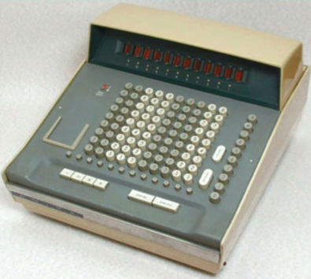
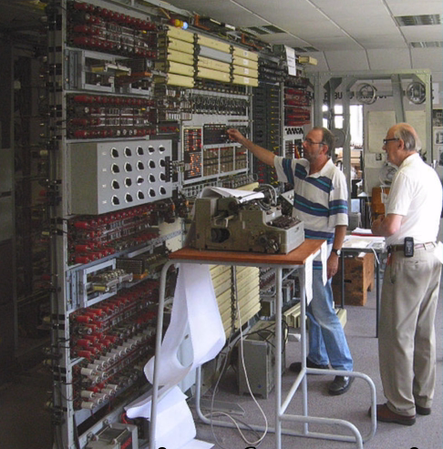
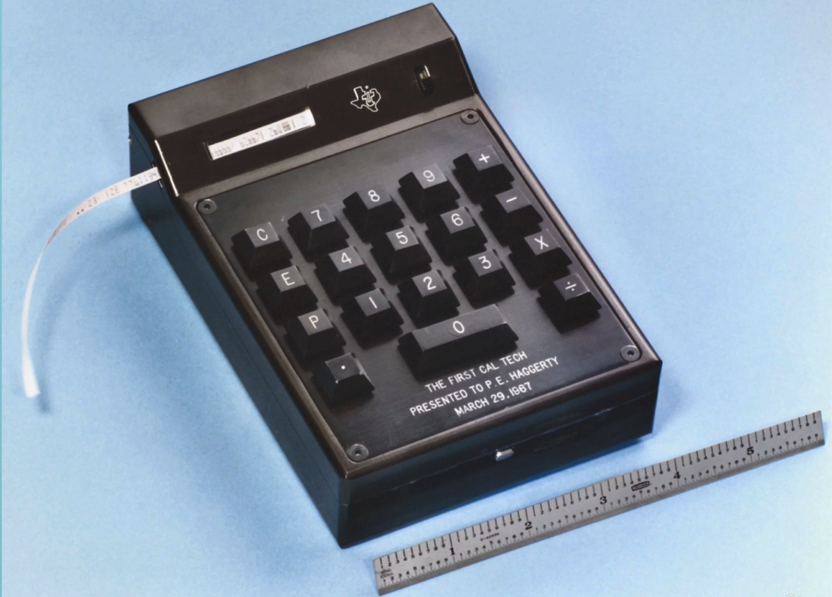
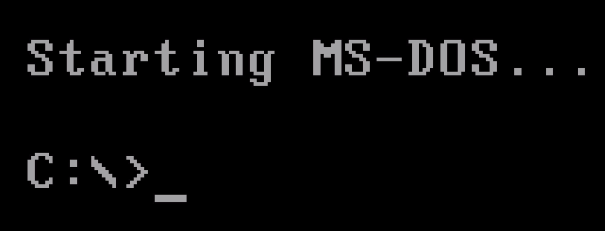
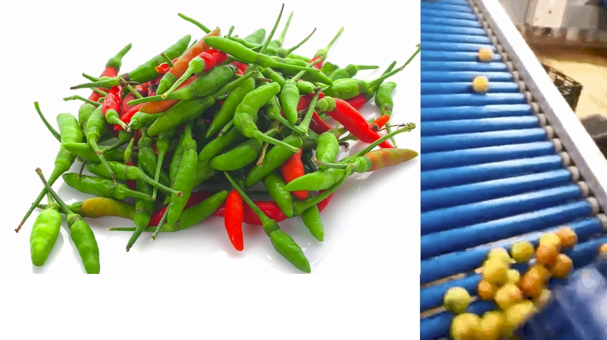
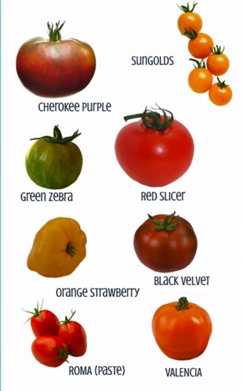
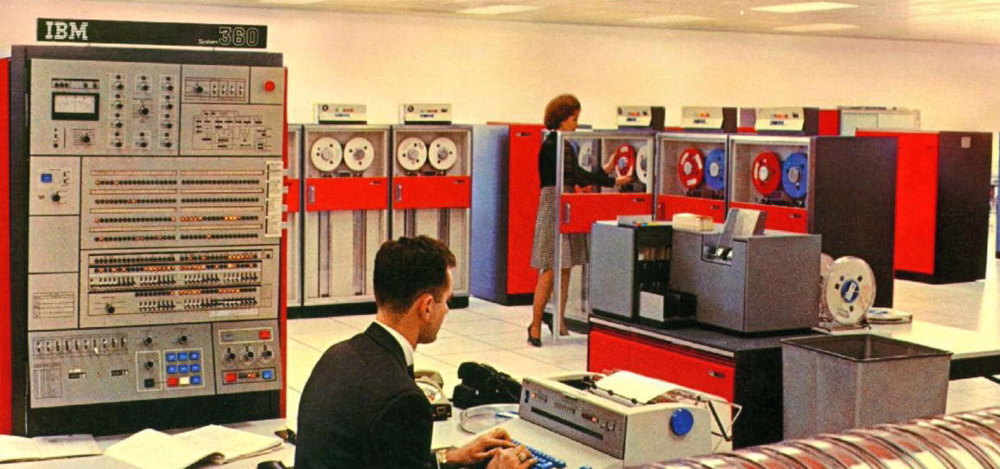
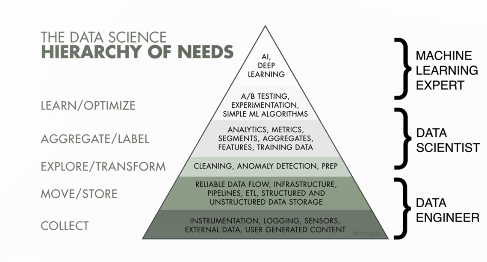
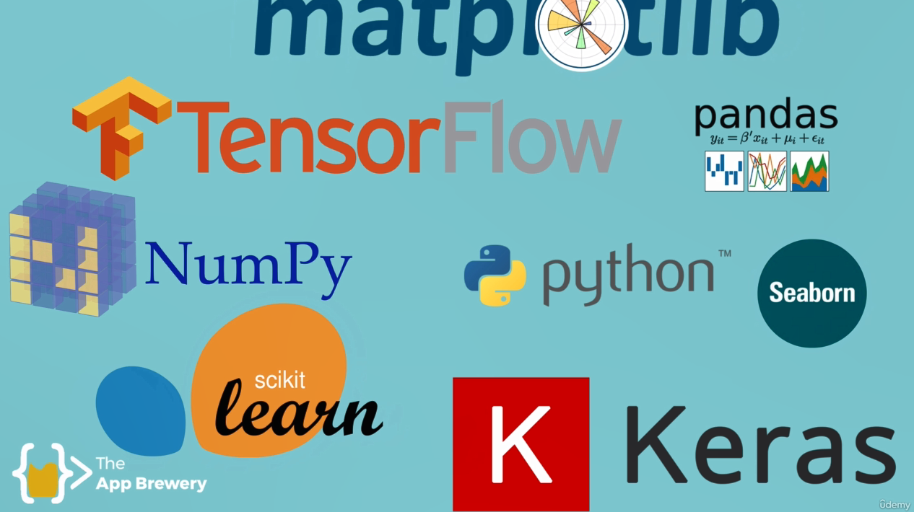

## machine learning 
the development of the computer started with one human urge \
computer exist  because some guys decided that he wanted to spend more time chiling\
the fundamental urge that drives any programer is laziness\
and we invented various forms of computing so that we acan work less and spend more time watching netflix.\
the first thing that could be considered remotly close to a computer was **abacus**\

but this still required us to know the time tables we progrmers were too lazy for that so we built a **calculator**\

there are quite a few step in between some breacking and a lot of movie fodder \

we figured out transistor and we could use them to perform logical tasks  so we now had something that could be vaguely programmed.\

but we obviously wanted to be even lazier and that required our computers to do more\
####  so  we invented programming languages we got rid of ticker tapes and started using crt screens. \

we were able to use a vaguely human readable languges like fortran or COBOL and converted into ones and zeros thats the computer could understand our programs could now be executed by the computer\

so now we can play games , send email and use excel insted of an abacus \
#### but what if we could get the computr to do even more of our work ? 

what about thing like identifying the unripe fruit our farm? what would you tell the computr ? what would your program look like ? if object color is red then keep  
```
if color == "red" {
    keep();
}
```
what if next week its chili harvesting time and you only want to keep the green ones?\
well , i guess you have to rewrite your code.
```
if color == "green" {
    keep();
}
```
### wouldnt it be great if we could actually teach the computer what a tomato is?
maybe we could refine our program . if something is round , red and around 100 grams it s proably a tomato . problem its more subtle than that you wouldnt tell your kids that eerthing red , round and 100 grams is edible , would you ?\
maybe we have to show athem lots of examples of tomatoes . 

###  💎now we are getting close to machine learning 
its similar to kids learning , but with machine.\
we gave them lots of diffrent examples and tought them that they are each a tomato  even if  they might look different when we do the same thing for our computers its called   `supervised learning ` \
once we have a trained machine learning model that knows what a ripe tomato look like 

## data science
its turning data into value \

IBM came out with the fire relational database storing things like  customer details or company  and soon after we started thinking about what useful things we can mine from the data and the term data mining was coind in a paper called ` from data mining to knowledge discovery in database` published in 1996  it define data mining as `the apllication of specific algorithms for extracting pattren from data`

learn how extract data from tools
