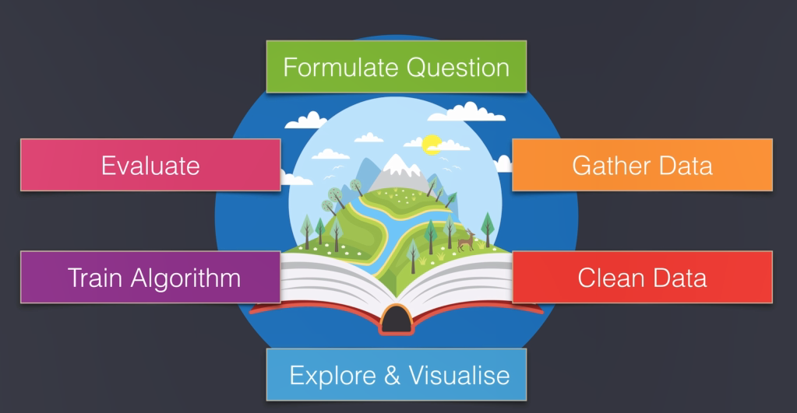
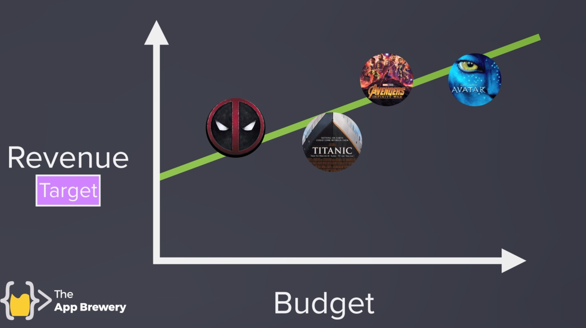

  ## linear regression
  

### you ll find people using regression whenever someone is looking to model a phenomenon or make a prediction or discover hidden relationship among things

for predict a work whether you lose money ? are you bankrupt?
to answer these question you would have to be able to predict the future and this is where data science will come to the rescue.\

## Formulate Question
dats science world carfuly formulate the question that they re looking to answer. why?
a clear and well formulated question will determine the research and it will also affect the kind of data that you will go out and gather. 
## Gather Data 

gathering is the data that will help us answer the question . but real world  data is also messy
## clean data
we have to clean data and  look out for missing data or incomplete data and  look out for errors snd even bound formating
## Explore & Visualise
we have to explore the data that we have gathered aand often this means visualizing the data so that we can better understand what it is that we are working.\
a graph or a chart is much more helpful than a table of members.
## Train Algorithm
using our computer to identify patterns in the data in our casethat algorithm will be our linear regression
## Evaluate
we have to evalute the result !
how did our algorithm do ?\
did it answer our question ? how accurate was our algorithm in answering our question ? the process that i ve outlined here is the process data scintists use to slove problem  this is their workflow for understanding and making sense of the world 

first step find the formula  like 
budget movie vs revene movie

second step find a source for gather data such  before example  go to [the numbers ](https://www.the-numbers.com/movie/budgets)website and catch the data relating to revenue and budget.\
so copy data and paste in google sheet \
third step  see data and remove bad  and empty data \
also trim data to numbers removing $ sign and other sign\
google sheet  \
`select culomn >format menu > more format > custom number format > select decimal number`
